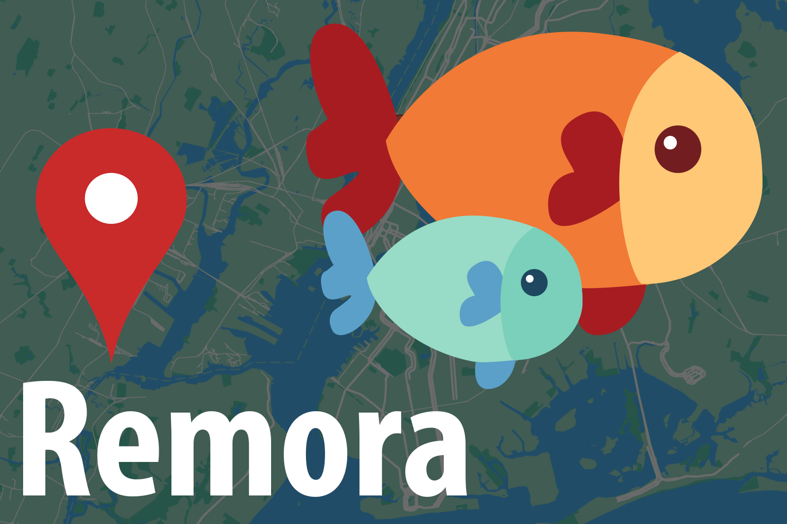

# Remora
Redistribute your leftover food to the homeless population. 

### Installation
To install be sure to have the following things installed:
* Node.JS (version 8.7)
* MongoDB
* Npm Modules:
  * Express.js
  * Twilio
  * Mongoose
  * NeoGeocoder

### Inspiration
Excess food is a huge problem in New York City. We wanted to learn how we could redistribute leftover food to those who would benefit from it. This brought us to the large homeless population in the city. We created Remora to directly connect people in New York to those who seek food and help. Ultimately, we hope we can reduce the amount of food that is thrown away every day and connect the people of New York by helping them help each other.

Also, try it at [34.214.100.137:1185](http://34.214.100.137:1185) and at the phone number (312)-248-6437!

### What it does
Remora is a service that allows those with food to locate those who need food in the city. Users who have food to give away can access the web app, and quickly register their name, location, and number. They then are taken to a map that displays people nearby who are in need of food. Remora is also a bot that allows those in need of food to sign up through SMS. With their saved numbers, Remora notifies them when someone nearby has food to give. It helps pinpoint a location which both individuals can meet.

### How we built it
We used Node.js and Express.js to build our web service with the help of MongoDB and Amazon Web Service (AWS). The SMS bot is also built in Node.js and uses Twilio to integrate SMS messenging. The database includes locations of "feeders" and "hungry" so we can plot their location on our web app and send out information about this process through Twilio. Other features of Remora uses Google Maps API and Google Street API to locate people in the city.

### Challenges we ran into
Both of us came to this hackathon with little Node experience. We had never used MongoDB or AWS so we spent most of our time understanding and debugging the passing of data into our DB. We scratched our heads when it came to creating the map of the hungry locations as that information came from Twilio and we were also receiving slightly different information on the our web app from feeders. We were able to overcome this challenge by merging our node files and hours of debugging.

### Accomplishments that we're proud of
We were able to create a working web app and SMS bot with UX that compliments our users. We knew that we wanted to make the experience as quick and easy to use. We were also able to come up with visual aids to enhance the familiarity of our sign up process. For example, instead of a user just replying with their location, they can type a well-known building nearby and Remora will also confirm their location by sending a Google Street View of the location.

### What we learned
We learned a new stack, Twilio, Node, Express, and MongoDB.

### What's next for Remora
Remora can pair up with local shelters that already provide food for the hungry. We can also create a business integration of Remora where it allows restaurant owners to distribute their leftover food.

